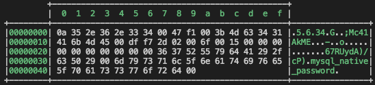

## Deno Bytes Formater

Formatting bytes(Uint8Array、Uint16Array、Uint32Array、ArrayBufferView..) output, is very useful when debugging IO functions

### Example

#### code

```ts
import { format, setColorEnabled } from "https://deno.land/x/bytes_formater/mod.ts";

const bytes = new Uint8Array([
    10, 53, 46, 54, 46, 51, 52, 0, 71, 241, 0, 59, 77, 99, 52, 49, 65, 107,
    77, 69, 0, 223, 247, 45, 2, 0, 111, 0, 21, 0, 0, 0, 0, 0, 0, 0, 0, 0, 0,
    54, 55, 82, 85, 121, 100, 65, 41, 47, 99, 80, 41, 0, 109, 121, 115, 113,
    108, 95, 110, 97, 116, 105, 118, 101, 95, 112, 97, 115, 115, 119, 111, 114,
    100, 0
]);

console.log(format(bytes));

// If you don't want to output with color
setColorEnable(false);

```

#### output

